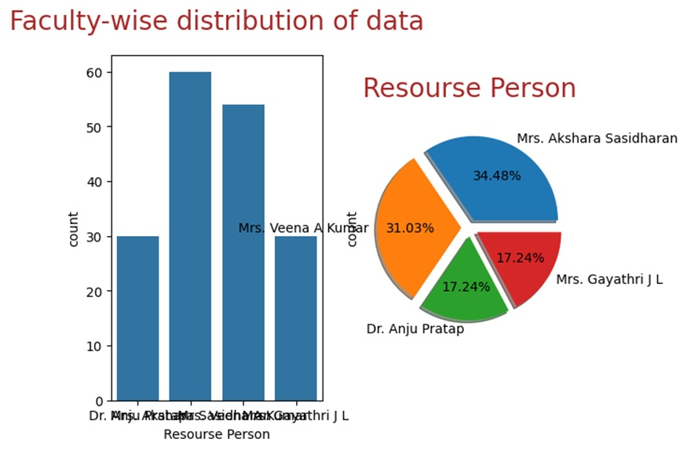
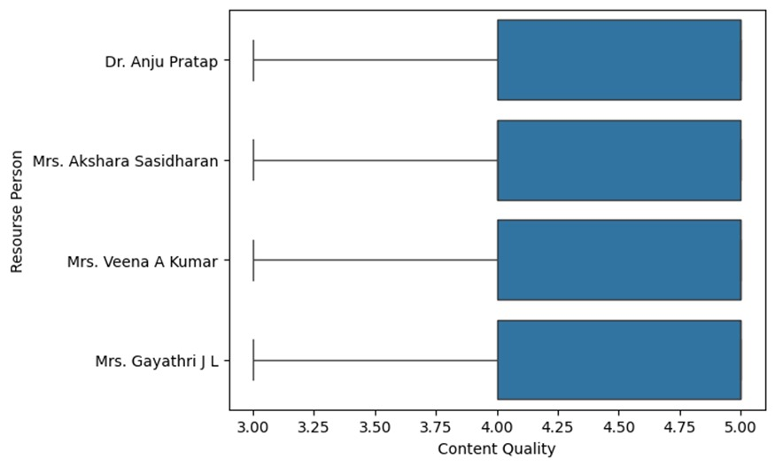
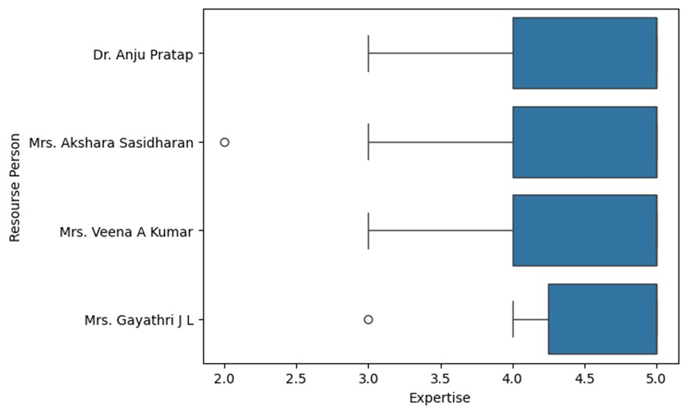
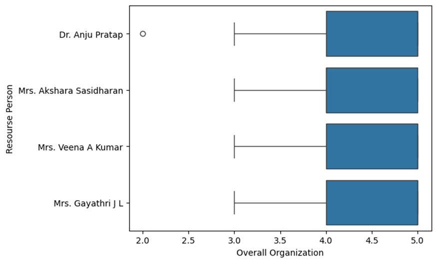
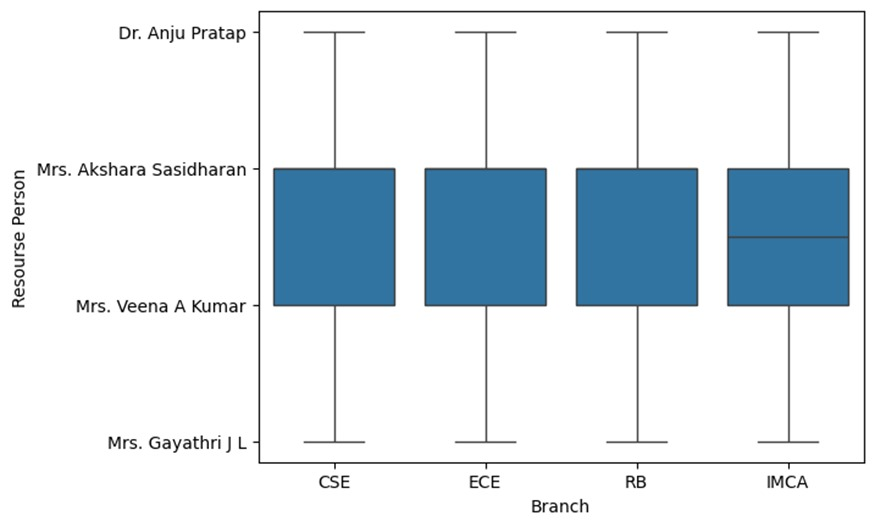
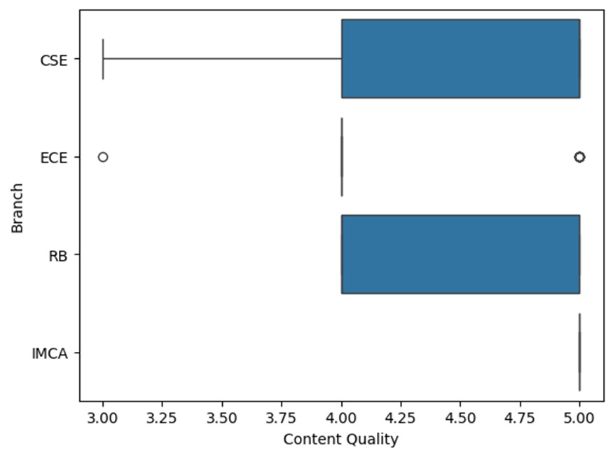
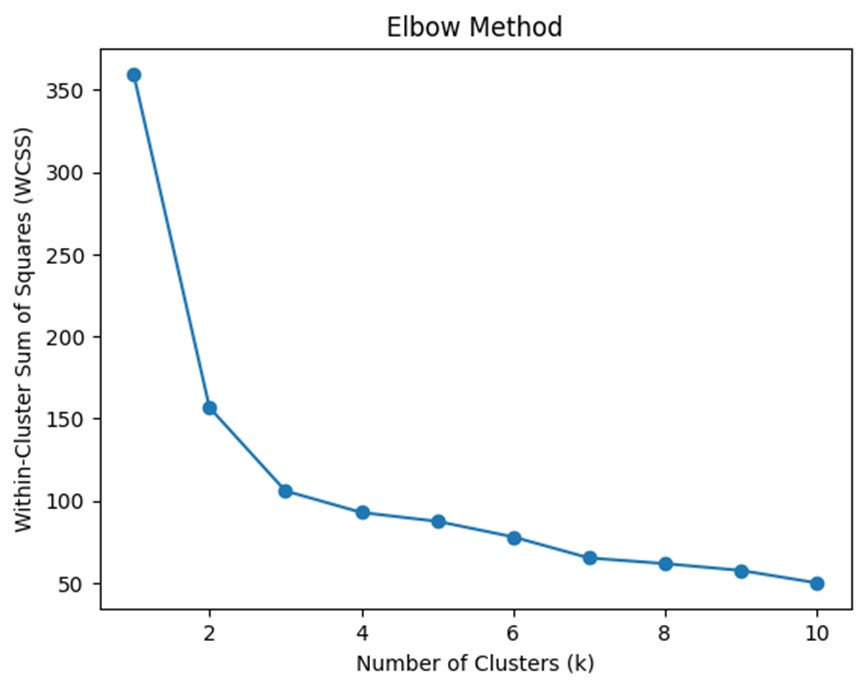
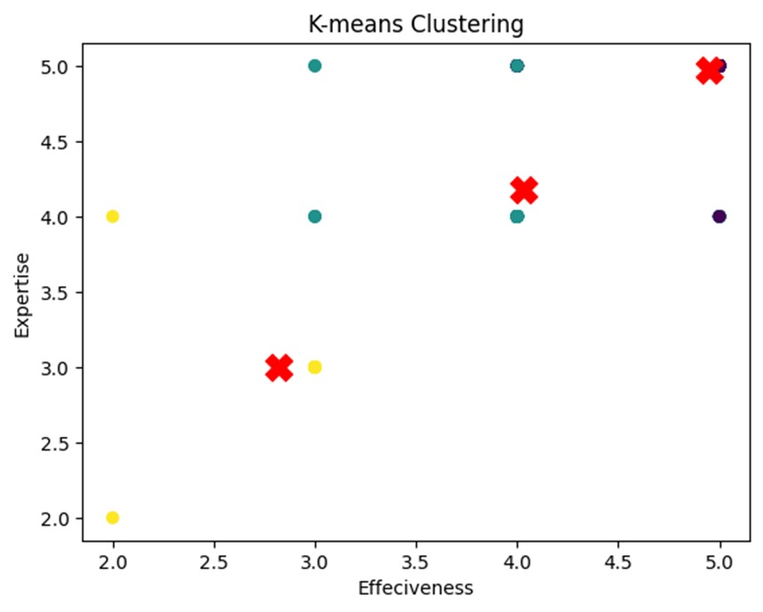

# Machine Learning Report on the Segmentation of Intel Certification Course Participants

## 1. Problem Statement

A study aimed at the segmentation of Intel Certification course participants over satisfaction level seeks to comprehend how participants perceive the course across various dimensions such as content quality, effectiveness, expertise, and relevance. The primary goal is to segment participants based on their feedback to enhance course delivery and content.

## 2. Introduction

Feedback analysis plays a pivotal role in educational settings, directly influencing the quality and delivery of instruction. By scrutinizing feedback from course participants, educators and institutions can pinpoint strengths and identify opportunities for enhancement. In this realm, machine learning offers powerful tools for segmenting feedback into meaningful categories that can be individually addressed.

## 3. Methodology

The study employs a combination of exploratory data analysis (EDA) and machine learning techniques. EDA is utilized to summarize the main characteristics of the data and identify patterns within the feedback. The segmentation is achieved through the K-means clustering algorithm, an unsupervised learning method that groups data based on feature similarity. The Elbow method assists in determining the optimal number of clusters.

## 4. Exploratory Data Analysis (EDA)

Visualizations reveal a balanced distribution of data across different resource persons, with Mrs. Akshara Sasidharan representing the largest share. Content quality ratings are predominantly high, as indicated by box plots, showing overall satisfaction. Nonetheless, variations and outliers in effectiveness, expertise, and overall organization suggest that while some sessions were highly rated, others warrant further examination.

 **Faculty-wise Distribution of Data:** 
-  The dataset shows a distribution among four resource persons, with proportions as follows:
- Mrs. Akshara Sasidharan: 34.48%
- Mrs. Veena A Kumar: 31.03%
- Dr. Anju Pratap: 17.24%
- Mrs. Gayathri J L: 17.24%
- The data is evenly distributed across faculties, with Mrs. Akshara Sasidharan having the largest share, facilitating a comprehensive feedback analysis across different teaching methods and content delivery.
- 
  ## Summary of Responses

Boxplot visualizations reveal the spread and central tendency of ratings for various criteria (content quality, effectiveness, expertise, relevance, and overall organization), showing predominantly high ratings with median values often at or near 5. Outliers indicate sessions with significantly lower ratings.

- **Content Quality Summary:** 
- Content quality is rated highly across all resource persons, indicating that the course material generally meets or exceeds expectations.

- **Effectiveness:**
-
-  Variability in the effectiveness of the training methods suggests the need for adaptation to accommodate diverse learning styles, despite the content's quality.

- **Expertise:**
-
- The instructors' expertise is highly regarded, with minimal outliers, underscoring the quality of instruction.

- **Relevance:**
- 
  High relevance scores are crucial for enabling participants to apply their learning in real-world scenarios, and this aspect is rated consistently well.

- **Overall Organization:**
- 
- While trending positively, the overall organization shows slightly more variability than other metrics, indicating room for improvement in time management and clarity of instructions.

- **Branch-wise Content Quality:**

- Analysis by branch reveals consistent content quality, with the ECE branch exhibiting slightly more variability, pointing to a potential area for focused enhancement.
### Elbow Method and K-means Clustering

The Elbow method suggests a preference for a smaller number of clusters for data segmentation. The resultant K-means clustering effectively visualizes these segments, potentially guiding course providers in tailoring resources and interventions to meet different groups' needs.

## Clustering Analysis

A scatter plot visualizes distinct groups based on Effectiveness and Expertise, indicating patterns that could predict student satisfaction levels.

## Overall Insights
- The feedback is largely positive, with notable instances of lower ratings warranting further investigation.
- The session concentration among certain faculty suggests areas for specialization or preference exploration.
- High relevance ratings demonstrate strong industry alignment, a commendable aspect.
- Variations in content quality perception by branch suggest the need for tailored content or differing expectations.

In summary, the combined EDA and K-means clustering offer valuable insights into the feedback from participants of the Intel Certification course. The analysis indicates high levels of satisfaction with content quality, expertise, and relevance. However, opportunities exist to enhance the effectiveness and overall organization of the sessions. Future course iterations could benefit from targeted improvements in these areas, informed by the segmentation analysis to develop differentiated strategies for content delivery and organization.

## 5. Machine Learning Model - K-means Clustering

The Elbow method visualization shows a smooth decline in within-cluster sum of squares (WCSS), with a less pronounced decline beyond the 4-cluster mark, hinting that 4 could be an optimal choice for 'k'. However, detailed feedback analysis documents the selection of 3 clusters for more in-depth analysis.

## 6. Results and Conclusion

Employing K-means clustering with k=3 unveils distinct segments within participant feedback. Visualizing clusters using effectiveness and expertise as features reveals clear segmentation, possibly reflecting varying levels of participant satisfaction or expectations.

